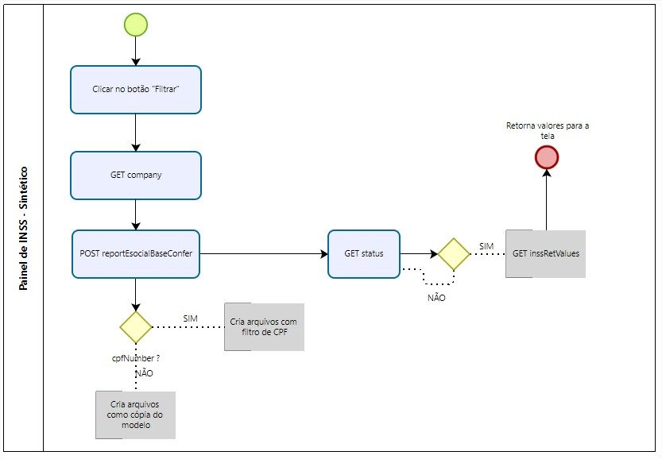
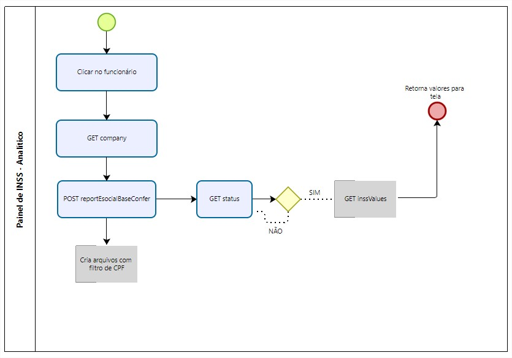

# API-RM-INSS

Essa API simula uma integração com o módulo de RM para o relatório de INSS.<br>
Ela será iniciada na porta 3002<br>

## Requisitos

<br>

- Possuir o [Node](https://nodejs.org/en/) instalado; <br>
- Baixar a pasta api-inss-rm, descompactá-la no seu diretório local; <br>
- Acessar a pasta api-inss-rm pelo prompt de comando:
  ```powershell
  > cd api-inss-rm-main
  ```
- instalar as dependências do node express:

  ```powershell
  > npm install express
  ```

- subir o serviço da API na porta 3002, com o comando abaixo:
  ```powershell
  > node index.js
  ```

<br><br>

Se a mensagem abaixo for exibida está tudo certo! :smile:

```powershell
API Started!
```

<br><br>

## Configuração TAF

<br>
Para que seja utilizada a busca dos valores do RH, deve-se preencher os seguintes parâmetros:<br><br>

**MV_TAFRHLG**: Usuario Basic Auth do Sistema de RH.<br>
Neste parâmetro, inserir o conteúdo: ADMIN <br><br>

**MV_TAFRHPW**: Senha Basic Auth do Sistema de RH.<br>
Neste parâmetro, inserir o conteúdo: 1234 <br><br>

**MV_TAFRHUR**: URL do Software de RH.<br>
Neste parâmetro, inserir o conteúdo: http://localhost:3002/rest

<br><br>

## Fluxo de Execução

Ao iniciar o relatório e clicar em "Filtrar", são realizadas as requisições

1. GET /rest/api/rh/esocial/v1/reportEsocialBaseConfer/company<br>
   Busca a coligada correspondente a filial do TAF.

2. POST /rest/api/rh/esocial/v1/reportEsocialBaseConfer <br>
   Neste momento ele cria a requisição do relatório que é executada de modo assíncrono. <br>
   Essa requisição pode ter ou não o filtro por CPF. <br>
   Caso tenha o filtro por CPF, o filtro será aplicado na geração dos seguintes arquivos: - inssRetValues.json (arquivo base para criação inssRetValues.db.json) - inssRetValues.json (arquivo base para criação inssValues.db.json)

3. GET /rest/api/rh/esocial/v1/reportEsocialBaseConfer/status <br>
   Ele verifica se o relatório terminou a execução.

4. GET /rest/api/rh/esocial/v1/reportEsocialBaseConfer/inssRetValues <br>
   Retorna os valores sintéticos (tela principal do painel de INSS), de acordo com o filtro de CPF passado.



<br><br>

Com os dados já exibidos em tela, ao clicar no funcionário para visualizar os valores analíticos, são realizadas as seguintes requisições:

1. GET /rest/api/rh/esocial/v1/reportEsocialBaseConfer/company<br>
   Busca a coligada correspondente a filial do TAF.

2. POST /rest/api/rh/esocial/v1/reportEsocialBaseConfer <br>
   Neste momento ele cria a requisição do relatório que é executada de modo assíncrono. <br>
   Essa requisição, obrigatoriamente, possui filtro por CPF. <br>
   O filtro será aplicado na geração dos seguintes arquivos: - inssRetValues.json (arquivo base para criação inssRetValues.db.json) - inssRetValues.json (arquivo base para criação inssValues.db.json)

3. GET /rest/api/rh/esocial/v1/reportEsocialBaseConfer/status <br>
   Ele verifica se o relatório terminou a execução.

4. GET /rest/api/rh/esocial/v1/reportEsocialBaseConfer/inssValues <br>
   Retorna os valores analíticos (modal do painel de INSS), de acordo com funcionário clicado.



<br><br>

## Descrição dos Endpoints criados

Os endpoints criados são:

- POST reportEsocialBaseConfer
- GET status
- GET company
- GET inssRetValues
- GET inssValues

# /rest/api/rh/esocial/v1/reportEsocialBaseConfer <br>

**Tipo:** POST <br>
**Descrição:** Inicia o relatório e retorna o requesId da execução. <br>
**Parâmetros:** Pode receber no body da requisição o filtro por CPF:<br>

    {
        "cpfNumber":["86657118058"]
    }

No final da requisição são criados os arquivos abaixo de acordo com o cpfNumber enviado. Caso não seja enviado um filtro, o arquivo será identico aos arquivos de base.

- inssRetValues.json (arquivo base: inssRetValues.db.json)
- inssRetValues.json (arquivo base: inssValues.db.json)

**Retorno:**

    {
        "requestId": "vda-d6c5-51cc-6ee1-7acc-00d69061a71a"
    }

# /rest/api/rh/esocial/v1/reportEsocialBaseConfer/status <br>

**Tipo:** GET <br>
**Descrição:** Retorna o statuas de execução do relatório. <br>
**Retorno:**

    {
        "percent": 100,
        "finished": true
    }

# /rest/api/rh/esocial/v1/reportEsocialBaseConfer/company <br>

**Tipo:** GET <br>
**Descrição:** Retorna a coligada de acordo com a filial do TAF. <br>Caso a branch passada seja "T1D MG 01 " ou "T1D MG 02 ", o valor retornado será "01". <br> Nos demais casos retornará "02". <br>
**Retorno:**

    {
        "companyId": "01"
    }

# /rest/api/rh/esocial/v1/reportEsocialBaseConfer/inssRetValues <br>

**Tipo:** GET <br>
**Descrição:** Retorna os valores sintéticos do relatório que são exibidos na tela principal. <br>

**Retorno:**

    {
      "hasNext": false,
      "items": [
        {
          "cpfNumber": "11209062020",
          "name": "STAN MARSH",
          "inssGrossValue": 828.38,
          "inssTafGrossValue": 828.38,
          "inssRetGrossValue": 828.38,
          "inssRetDescGrossValue": 828.38,
          "inss13GrossValue": 0,
          "inss13TafGrossValue": 0,
          "inss13RetGrossValue": 0,
          "inss13DescGrossValue": 0,
          "familySalaryValue": 0,
          "familySalaryTafValue": 0,
          "familySalaryRetValue": 0,
          "maternitySalaryValue": 0,
          "maternitySalaryTafValue": 0,
          "maternitySalaryRetValue": 0,
          "maternitySalary13Value": 0,
          "maternitySalary13TafRetValue": 0,
          "maternitySalary13RetValue": 0,
          "divergent": false
        },
        {
          "cpfNumber": "47502029087",
          "name": "KENNY MCCORMICK",
          "inssGrossValue": 110,
          "inssTafGrossValue": 110,
          "inssRetGrossValue": 110,
          "inssRetDescGrossValue": 111,
          "inss13GrossValue": 0.2,
          "inss13TafGrossValue": 0.2,
          "inss13RetGrossValue": 0.2,
          "inss13DescGrossValue": 0.2,
          "familySalaryValue": 100,
          "familySalaryTafValue": 100,
          "familySalaryRetValue": 100,
          "maternitySalaryValue": 200,
          "maternitySalaryTafValue": 200,
          "maternitySalaryRetValue": 200,
          "maternitySalary13Value": 20,
          "maternitySalary13TafRetValue": 20,
          "maternitySalary13RetValue": 20,
          "divergent": true
        },
        {
          "cpfNumber": "66478431088",
          "name": "ERIC CARTMAN",
          "inssGrossValue": 100,
          "inssTafGrossValue": 100,
          "inssRetGrossValue": 100,
          "inssRetDescGrossValue": 100,
          "inss13GrossValue": 0.1,
          "inss13TafGrossValue": 0.1,
          "inss13RetGrossValue": 0.1,
          "inss13DescGrossValue": 0.1,
          "familySalaryValue": 30,
          "familySalaryTafValue": 30,
          "familySalaryRetValue": 30,
          "maternitySalaryValue": 40,
          "maternitySalaryTafValue": 40,
          "maternitySalaryRetValue": 40,
          "maternitySalary13Value": 50,
          "maternitySalary13TafRetValue": 50,
          "maternitySalary13RetValue": 50,
          "divergent": false
        }
      ]
    }

# /rest/api/rh/esocial/v1/reportEsocialBaseConfer/inssValues <br>

**Tipo:** GET <br>
**Descrição:** Retorna os valores ananlíticos do relatório que são exibidos na tela ao clicar no funcionário. <br>

**Retorno:**

    {
      "hasNext": false,
      "items": [
        {
          "cpfNumber": "11209062020",
          "name": "STAN MARSH",
          "branchId": "27231185000100",
          "lotationCode": "1021200001",
          "esocialCategory": 101,
          "esocialRegistration": "MAT_11209062020",
          "inssValue": 828.38,
          "inssTafValue": 828.38,
          "inssRetValue": 828.38,
          "inss13Value": 0,
          "inss13TafValue": 0,
          "inss13RetValue": 0,
          "inssBasis": 0,
          "inssTafBasis": 0,
          "inssRetBasis": 0,
          "familySalaryValue": 0,
          "familySalaryTafValue": 0,
          "familySalaryRetValue": 0,
          "maternitySalaryValue": 0,
          "maternitySalaryTafValue": 0,
          "maternitySalaryRetValue": 0,
          "inss13Basis": 0,
          "inss13TafBasis": 0,
          "inss13RetBasis": 0,
          "maternitySalary13Value": 0,
          "maternitySalary13TafRetValue": 0,
          "maternitySalary13RetValue": 0
        },
        {
          "cpfNumber": "47502029087",
          "name": "KENNY MCCORMICK",
          "branchId": "27231185000100",
          "lotationCode": "1021200001",
          "esocialCategory": 101,
          "esocialRegistration": "MAT_47502029087",
          "inssValue": 110,
          "inssTafValue": 110,
          "inssRetValue": 110,
          "inss13Value": 80,
          "inss13TafValue": 80,
          "inss13RetValue": 80,
          "inssBasis": 9500,
          "inssTafBasis": 9500,
          "inssRetBasis": 9500,
          "familySalaryValue": 90,
          "familySalaryTafValue": 90,
          "familySalaryRetValue": 90,
          "maternitySalaryValue": 130,
          "maternitySalaryTafValue": 130,
          "maternitySalaryRetValue": 130,
          "inss13Basis": 0.2,
          "inss13TafBasis": 0.2,
          "inss13RetBasis": 0.2,
          "maternitySalary13Value": 35,
          "maternitySalary13TafRetValue": 35,
          "maternitySalary13RetValue": 35
        },
        {
          "cpfNumber": "66478431088",
          "name": "ERIC CARTMAN",
          "branchId": "27231185000100",
          "lotationCode": "1021200001",
          "esocialCategory": 101,
          "esocialRegistration": "MAT_66478431088",
          "inssValue": 100,
          "inssTafValue": 100,
          "inssRetValue": 100,
          "inss13Value": 80,
          "inss13TafValue": 80,
          "inss13RetValue": 80,
          "inssBasis": 9500,
          "inssTafBasis": 9500,
          "inssRetBasis": 9500,
          "familySalaryValue": 90,
          "familySalaryTafValue": 90,
          "familySalaryRetValue": 90,
          "maternitySalaryValue": 130,
          "maternitySalaryTafValue": 130,
          "maternitySalaryRetValue": 130,
          "inss13Basis": 0.1,
          "inss13TafBasis": 0.1,
          "inss13RetBasis": 0.1,
          "maternitySalary13Value": 35,
          "maternitySalary13TafRetValue": 35,
          "maternitySalary13RetValue": 35
        }
      ]
    }
